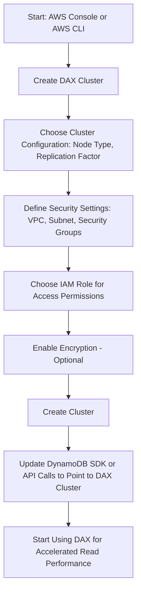

> [!simple] Simple
> **DynamoDB Accelerator (DAX)** is a fully managed, in-memory caching service for DynamoDB that improves read performance by reducing response times from milliseconds to microseconds, making it ideal for applications that require extremely fast read access. It’s useful because it seamlessly integrates with DynamoDB, offloading read-heavy workloads and reducing the load on your database.

- $ Microsecond latency for cached reads & queries
- $! No change to application logic
- ! 5 minute [[TTL (Time to Live)]] for cache by default
- ~ Up to 10 nodes in the cluster
- ! Allows for Multi-AZ (3 nodes minimum recommended)
- $ Very secure

# Versus ElastiCache
- ElastiCache used to store Aggregation Results
- DAX to store individual objects and query/scan cache

| **Feature**                         | **DynamoDB Accelerator (DAX)**                                 | **[[ElastiCache]] for DynamoDB**                                                   |
| ----------------------------------- | -------------------------------------------------------------- | ---------------------------------------------------------------------------------- |
| **Primary Use Case**                | Caching for DynamoDB to accelerate read-heavy workloads        | General-purpose caching for various databases, including DynamoDB                  |
| **Integration**                     | Purpose-built for DynamoDB, no code changes needed for queries | Requires custom implementation to connect with DynamoDB                            |
| **Read Performance**                | Microsecond latency for cached reads                           | Microsecond to millisecond latency depending on configuration                      |
| **Write Performance**               | Pass-through for writes; no write caching                      | Can cache writes but typically used for read caching; requires manual invalidation |
| **Complexity**                      | Simple setup, tightly integrated with DynamoDB                 | Requires more complex setup and management                                         |
| **Cost Efficiency**                 | Designed to minimize DynamoDB read costs through caching       | Can be cost-effective but requires more tuning and management overhead             |
| **Automatic Failover**              | Yes, built-in for high availability                            | Yes, available with Redis and Memcached clusters                                   |
| **Consistency**                     | Eventually consistent reads from cache                         | Requires manual management of cache invalidation for consistency                   |
| **Supported Data Types**            | Only for DynamoDB table data                                   | General-purpose caching for various data stores (Redis/Memcached)                  |
| **Use with Non-DynamoDB Workloads** | No, DAX is DynamoDB-specific                                   | Yes, supports caching for multiple database types and use cases                    |
# Hands On

