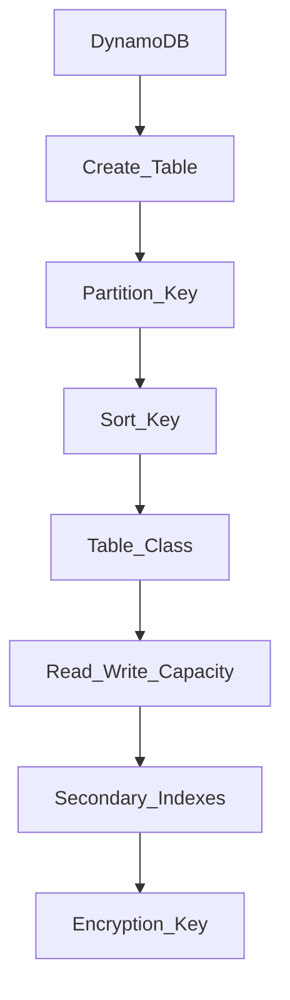

*NoSQL Serverless Database*
- $! Distributed, allowing horizontal scalability
- ^ Do not support query joins
- ^ Do not perform aggregations

# Stats
- $ Fully managed, highly available (replication acroess multiple AZs)
- $! Allows millions of requests per seconds, trillions of rows, 100s of TB of storage
- $ Fast and consistent in performance
- $ Integrated with IAM for security, authorization, and admin
- $ Event driven programming with DynamoDB Streams
- $ Auto Scaling
- $ Standard & IA Table Classes

# Structure
- Made up of **Tables**
- Each has Primary Key
- Can have an infinity number of items (rows)
- Each item can have attributes
- !! Max size of an item is 400KB
## Supported data types
- Scalar Types (String, Number, Boolean, Null)
- Document Types (List, Map)
- Set Types (String Set, Number Set, Binary Set)

## Primary Key
### Partition Key (HASH)
- Must be unique
- ! Must be diverse so that the data is distributed

### Partition Key + Sort Key (HASH + RANGE)
- Combination of two fields (must be unique combination)
- Data is grouped by partition key
- E.g. User_ID and Game_ID (Users can go to multiple games)

## Read Write Capacity
- **On-demand** charges for the actual read and writes of your application
- **Provisioned** allocates capacity in advance

# Setup
