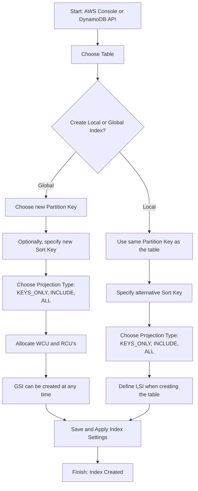

## Local Secondary Index (LSI)
*Gives you an alternative sort key (same as the Partition Key of the base table*
- ! Is basically a way of querying a specific attribute/field more efficiently
- $ Up to 5 LSIs per table
- ^ Must be defined at table creation time
- ! Uses the WCU and RCUs of the main table; Throttling occurs only when the WCU and RCUs of the main table are exceeded

## Global Secondary Index (GSI)
*Gives you an alternative partition key and sort key*
- $ Consists of scalar attributes (string, number, binary)
- $ Can include up to 20 GSIs per table
- ^ You must provision RCUs & WCUs for the index
- $! Can be defined after table creation
- !! If writes are throttled on the GSI, the main table will be throttled
	- This occurs even when the WCUs on the main table are fine
- ! Choose GSI partition key and assign WCU capacity carefully
## Comparison
| **Feature**                   | **Local Secondary Index (LSI)**                                           | **Global Secondary Index (GSI)**                                                                     |
| ----------------------------- | ------------------------------------------------------------------------- | ---------------------------------------------------------------------------------------------------- |
| **Partition Key**             | Must be the **same** as the base table                                    | Can be **different** from the base table                                                             |
| **Sort Key**                  | Can be **different** from the base table                                  | Can be **different** from the base table                                                             |
| **When It’s Created**         | Must be created when the table is created                                 | Can be created **at any time**                                                                       |
| **Number of Indexes Allowed** | Up to **5 LSIs** per table                                                | Up to **20 GSIs** per table                                                                          |
| **Size Limitation**           | Shares the 10 GB limit per partition                                      | No size limitation tied to the main table                                                            |
| **Use Case**                  | Useful when querying the same partition key but need a different sort key | Useful when you need an entirely different access pattern with a different partition and/or sort key |
| **Query Performance**         | Queries are fast, but limited by 10 GB partition size                     | Scales independently, no size limitations per partition                                              |
## Attribute Projections
*Allows you to easily include attributes to create within indexes*
- $ Choose only the attributes useful enough to query with

## Info
- $ Can increase the query performance of both the original key as well as other attributes in the table
- ^ Will increase the storage cost as the index (like that of an RD) will need to be stored as well
- ^ Will increase the write cost as the index will have to be updated as well when data is created or updated
- ! As indexes are stored at the partition level, they will count towards the 10GB limit for each partition

# Hands On

