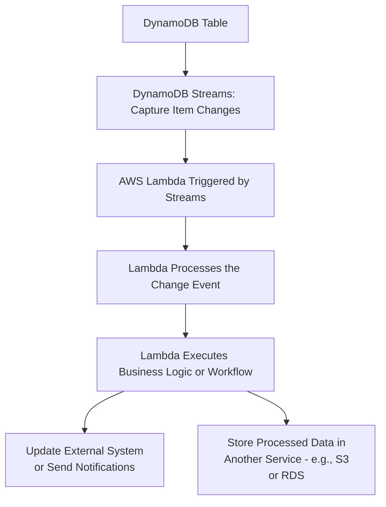
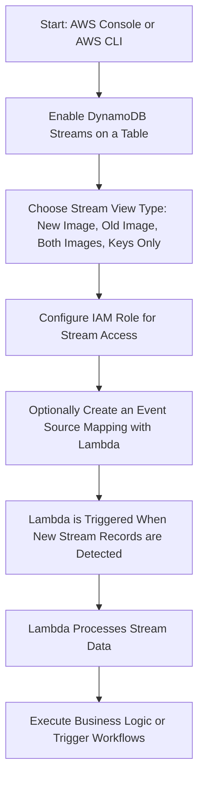

> [!simple] Simple
> **DynamoDB Streams** capture a time-ordered sequence of changes (inserts, updates, deletes) to items in a DynamoDB table, allowing you to track and react to changes in real-time. It’s useful for building event-driven architectures, triggering Lambda functions, or syncing data with other systems.

- ! Records can be:
	- Sent to Kinesis Data Streams
	- Red by AWS Lambda
	- Read by Kinesis Client Library applications
- $ Data retention for up to 24 hours
- ! Streams are made up of shards, same as Kinesis Data Streams
	- $ Shards are provisioned by AWS
- !! Records are not retroactively populated in a stream once enabling it
- ! When coupled with Lambda, outputs can be seen within CloudWatch logging

# Info written

| Option             | Info Presented                                      |
| ------------------ | --------------------------------------------------- |
| KEYS_ONLY          | Only the key attributes of the modified item        |
| NEW_IMAGE          | The entire item, as it appears after modification   |
| OLD_IMAGE          | The entire item, as it appeared before modification |
| NEW_AND_OLD_IMAGES | Both the new and the old images of the item         |

# Use with Lambda

# Use Cases

| **Use Case**                               | **Description**                                                                                  |
|--------------------------------------------|--------------------------------------------------------------------------------------------------|
| **Real-Time Data Replication**             | DynamoDB Streams can be used to replicate changes from one table to another in real-time, ensuring data consistency across regions or systems. |
| **Triggering AWS Lambda Functions**        | Streams can trigger AWS Lambda functions when changes occur in a table, enabling serverless event-driven processing. |
| **Audit Logging**                          | Capture and store changes to items for auditing purposes, allowing you to track who changed what and when. |
| **Materialized Views**                     | Use Streams to maintain precomputed, query-friendly views of your data by capturing updates and applying transformations. |
| **Data Synchronization**                   | Sync data between DynamoDB and other services or databases, keeping different data stores up to date in real time. |
| **Event-Driven Architectures**             | Streams allow you to react to specific changes in your data, triggering workflows or external services. |
| **Change Data Capture (CDC)**              | Track all data changes (inserts, updates, deletes) to create change logs or integrate with external systems that require CDC. |
| **Analytics Pipelines**                    | Use Streams to send data changes to analytics services like Amazon Redshift or Elasticsearch, enabling near real-time analytics. |

![[Pasted image 20240910142702.png]]
# Hands On

