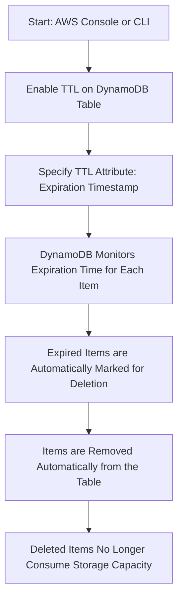

> [!simple] Simple
> **TTL (Time to Live)** in DynamoDB automatically deletes expired items from a table after a specified timestamp. It’s useful for managing data lifecycle, ensuring that old, irrelevant data is removed to save storage costs and keep tables optimized.

- $ Doesn’t consume WCU’s
- ! Format must be **Number** data type with a **Unix Epoch** timestamp
- ! Items are guaranteed to be deleted within 48 hours (deletion time is usually quicker)
- ^ Expired items may appear in queries if they haven’t been deleted yet
	- ! You must filter them out if you want to exclude the,
- $ Expired items are deleted from both LSIs and GSIs
- ! Delete operations can be seen in DynamoDB Streams
	- $ This can help when you need to recover items
- ! The attribute TTL uses must be manually created
	- !! TTL only monitors the attribute and deletes any items that have an epoch time before the present time when processed

# Use Cases
| **Use Case**               | **Description**                                                                                                        |
| -------------------------- | ---------------------------------------------------------------------------------------------------------------------- |
| **Session Management**     | Automatically remove expired user sessions after a certain period, ensuring only active sessions remain.               |
| **Event Logging**          | Store logs with an expiration time to automatically delete old logs and keep only recent data, reducing storage costs. |
| **Temporary Data**         | Remove temporary data, such as verification codes or temporary tokens, after they have served their purpose.           |
| **Caching Layer**          | Implement a TTL on cached items in [[DAX]], so old cache entries are removed automatically, ensuring freshness.        |
| **IoT Data Expiry**        | For IoT applications, automatically delete outdated sensor data after it is no longer needed for analysis.             |
| **User-Generated Content** | Set expiration on user-generated content that is only valid for a limited time, such as posts or messages that expire. |
| **Data Archival**          | Use TTL to automatically delete old records once they are archived or no longer required, keeping the table lean.      |
# Hands On

