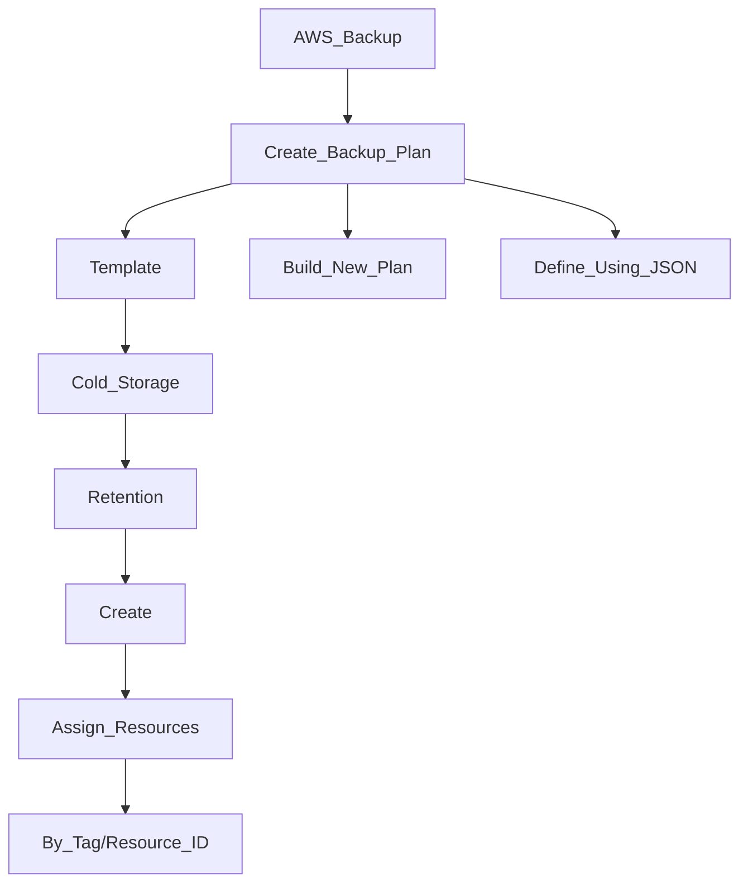

*Fully managed service showing a central view of backups across AWS services*

Supported services:
- Amazon EC2 / Amazon EBS
- Amazon S3
- Amazon RDS (all DBs engines) / Amazon Aurora / Amazon DynamoDB
- Amazon DocumentDB / Amazon Neptune
- Amazon EFS / Amazon FSx (Lustre & Windows File Server)
- AWS Storage Gateway (Volume Gateway)

# AWS Backup Vault Lock
- Enforce a WORM (Write Once Read Many)
- Additional layer of defense
	- Inadvertent or malicious delete operations
	- Updates that shorten or alter retention periods
	- ! Even root user cannot delete backups

# Setup

# General Notes
- Supports cross-region backups
- Supports cross-account backups
- - Supports PITR for supported services
- On Demand and Scheduled backups
- Tag-based backup policies
- Backup policies are called **Backup Plans**
	- Backup frequency (every 12 hours, daily, weekly, monthly, cron expression)
	- Backup window
	- Transition to Cold Storage
	- Retention Period
![[Screenshot 2024-04-21 at 5.12.56 PM.png]]