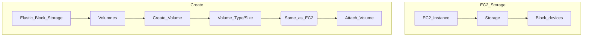

*(Elastic Block Store) Volume is a network drive you can attach to EC2 instances while they run. Metaphor "network USB stick"*

- $ Allows instances to persist data, even after temination
- Can only be mounted to one instance at a time (CCP level)
	- ! Associate Level (Solutions Architect, Developer, SysOps) allow "multi-attach for some EBS"
- ! Bound to a specific availability zone (AZ)
	- To move to new AZ, first need to snapshot it
- ^ Because communication is over a network, there might be latency
	- $ Allows the storage to be detached and reattached very quickly

# Capacity/Cost
- ! Provisioned capacity in GBs and IOPS
- Billed for all provisioned capacity
- $ Can Increase capacity of the drive over time

![[Screenshot 2024-04-21 at 3.17.41 PM.png]]

# Setup

# Elastic EBS Volumes
*Allow you to modify the EBS volume without any down time*
- $ Increase volume size
- ^ Cannot Decrease volume size
- $ Change volume type (Gp2 -> Gp3)
- $ Adjust (increase/decrease) performance (IOPS/througput)
# General Notes
- Delete on Termination
	- Root volume of EC2 deleted by default on termination
	- EBS is not deleted on termination by default