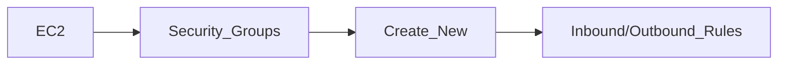
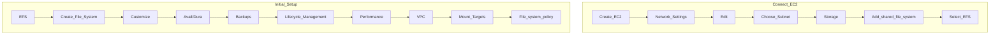

*Managed NFS (netowrk file system) that can be mounted on many EC2*
- ! Works with EC2 instances in multi-AZ
- $ Highly available, scalable, expensive (3x [[EBS|gp2]]), pay per use

Use Cases:
- Content management
- Web serving
- Data Sharing
- Wordpress

# Performance & Storage Classes
## Performance
- $ 1000s of concurrent NFS clients, 10GB + /s throughput
- $ Grow to petabyte network file system automatically
### Performance Mode
- General Purpose (default) - latency-sensitive use cases
	- Web server
	- CMS
- Max I/O - higher latency, throughput, highly parallel
	- Big data
	- Media Processing
### Throughput Mode
- Bursting - 1 TB = 50MiB/s + burst of up to 100MiB/s
- Provisioned - set throughput regardless of storage size e.g. GiB/s for 1 TB storage
- Elastic - automatically scales througput up or down based on workloads
	- Up to 3GiB/s for reads and 1GiB/s for writes

## Storage Classes
### Storage Tiers
- Standard - For frequently access filed
	- $ Instant Access
	- ^ More expensive
- Infrequent Access (EFS-IA) ^71d8da
	- ^ Cost to retrieve files
	- $ Lower price to store
	- Can be setup using lifecycle features (similar to [[Lifecycle Rules|S3 Lifecyle Rules]])

### Availability/Durability
- Standard - Multi-AZ
	- $ Great for Prod
- One Zone - One AZ
	- $ Great for dev
	- $ Backup enabled by default
	- $ Compatible with [[#^71d8da|IA]]
	- $! EFS One Zone-IA has over 90% in cost savings

![[Pasted image 20240421163905.png]]

# Security Groups
*Security groups must be created when setting up the mount targets in multiple AZs*
## Setup

# Setup

# General Notes
- Uses NFSv4.1 protocol
- Uses security group to control access to EFS
- ! Compatible with Linux based [[AMI]] (not Windows)
- Encryption at rest using KMS
- $ Standard POSIX file system with standard file API
- $ File system scales automatically, pay-per-use