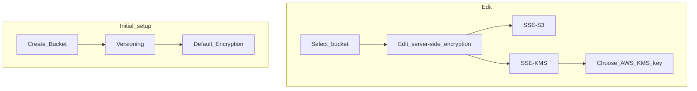

# Methods
## Server-Side Encryption (SSE)

### Server-Side Encryption with Amazon S3-Managed Keys (SSE-S3)
*Encrypts objects using keys handled, managed, and owned by AWS*
- Object is encrypted server-side
- $ Encryption type is AES-256
- !! Must set header "x-amz-server-side-encryption":"AES256"
- ! Enabled by default for new buckets and new objects

![[Pasted image 20240421142635.png]]

### Server-Side Encryption with KMS Keys stored in AWS KMS (SSE-KMS)
*Leverage AWS Key Management Service (KMS) to manage encryption keys*
- $ User control + audit key usage with [[CloudTrail]]
- !! Must set header "x-amz-server-side-encryption":"aws:kms"
- ^ Must leverage KMS API when uploading/downloading, counting towards the KMS quota per second (5500, 10000, 30000 req's based on region)
	- Uploading calls **GenerateDataKey**
	- Downloading calls **Decrypt**
![[Screenshot 2024-04-21 at 2.28.06 PM.png]]

### Server-Side Encryption with Customer-Provided Keys (SSE-C)
*Allows the user to manage their own encryption keys*
- $ S3 does NOT store the encryption key provided
- ! HTTPS must be used
- ! Encryption key must be provided in HTTP headers, for every HTTP request made

![[Pasted image 20240421143445.png]]
## Client-Side Encryption
*Client encrypts data before sending to AWS*
- Use client libraries such as Amazon S3 Client-Side Encryption Library
- Client encrypts and decrypts

![[Screenshot 2024-04-21 at 2.36.28 PM.png]]

## Encryption in transit
*Encryption that occurs in the process of sending (also called SSL/TLS)*

- S3 exposes two endpoints
	- ^ HTTP Endpoint - non encrypted
	- $ HTTPS Endpoint - encryption in flight
	- ! HTTPS is mandatory for [[#Server-Side Encryption with Customer-Provided Keys (SSE-C)|SSE-C]]

### Force Encryption in transit
Apply a Bucket Policy that denies access when not using aws:SecureTransport (HTTP)

![[Screenshot 2024-04-21 at 2.40.46 PM.png]]

# Setup

# Default Encryption vs [[Security (Bucket Policy)|Bucket Policies]]
- $ SSE-S3 encryption is automatically applied to new objects stored in S3 bucket
- !! You can force encryption using a bucket policy or refuse any API call to PUT an S3 object without encryption headers (SSE-KMS or SSE-C)
- ! Bucket Policies are evaluated before default encryption

![[Screenshot 2024-04-21 at 2.53.50 PM.png]]
# General Notes
- ! When choosing AWS KMS key, default S3 KMS key should show automatically (free option)

