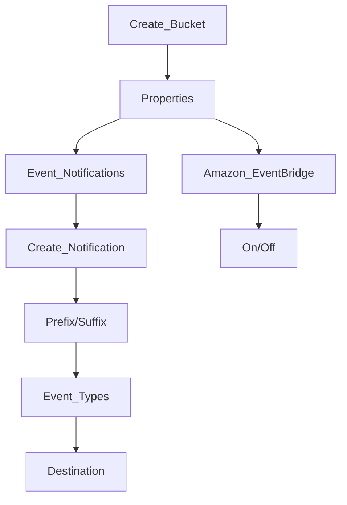

*Occurrences of various actions that can be taken in S3 (S3:ObjectCreated, S3:Replication)*

# IAM Permissions
- Used to allow [[SNS]], [[SQS]], and [[Lambda Functions]] usage for S3
- !! Must enhance the Access Policy within the destination

# [[EventBridge]]
All S3 events will get sent to Amazon EventBridge, allowing a more centralized way to delegate what destination services receive the events (through the creation of rules)
- $ Allow for Advanced filtering options with JSON rules
- $ Send to multiple destinations ([[Step functions]], [[Kinesis]], [[Firehouse]])
- $ Allows for EventBridge capabilities (Archive, Replay Events, Reliable delivery)
- ^ More complex to setup

# Use Cases
- Generate thumbnails of images uploaded to S3

# Setup

# General Notes
- Object name filtering possible (*.jpg)
- Generally delivered in seconds but can sometimes take a minute or longer

