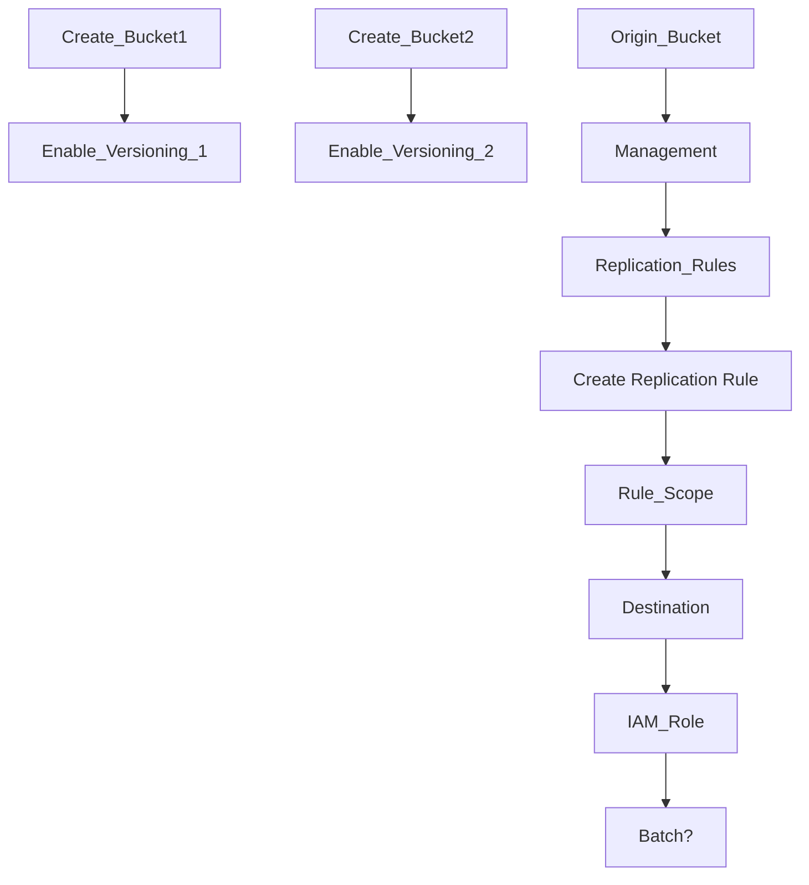

> [!info]
> Allows object in a bucket to be stored (replicated) in another region to avoid data corruption

# Info
- Must have [[Versioning]] enabled
- Must give proper IAM permissions to S3
- Copying is asynchronous
- ! Only new objects will be replicated after it is enabled
- ! Existing objects can be replicated with S3 Batch Replication

Can be either:
## CRR 
- Cross-Region Replication
- Use cases:
	- Compliance
	- $ Lower latency access
	- $ Replication across accounts
## SRR
- Same-Region Replication
- Use cases:
	- $ Log aggregation
	- $ Live replication between prod and test

# Setting Up

# Params
## Choose a rule scope
- Allows a user to filter what objects get replicated OR all objects get replicated

## Destination
- Choose bucket in the account OR outside of the account (bucket name)

## IAM role
- Create a new role OR choose an existing role

## Delete Marker Replication
- Will replicate the delete marker in each of the replicas
- ! Permanent deletes will not be replicated in replicas (they will keep the file)

> [!Important] 
> When an object is replicated, it keeps the same [[Versioning|Version ID]]
