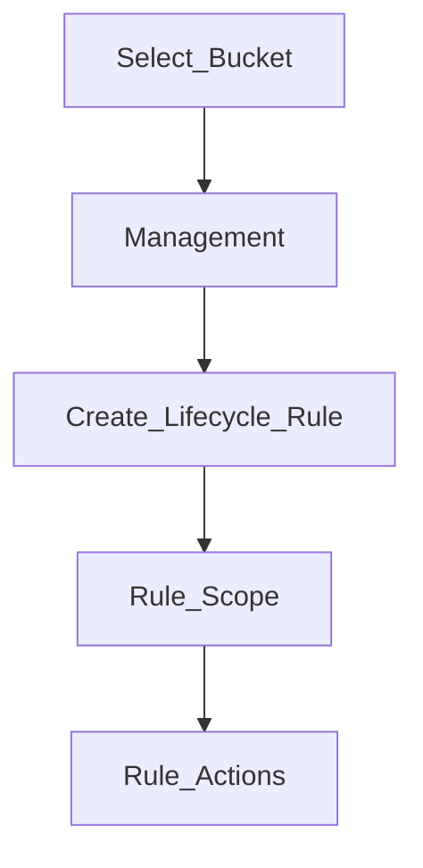
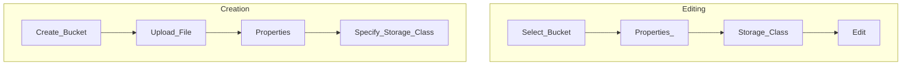

# S3 Standard
Used for frequently accessed data
- $ 99.99% Available
- $ Low latency, high throughput
- $ Sustain 2 concurrent facility failures
- ~ Medium Cost

# S3 IA
## S3 Standard-Infrequent Access
For data that is not frequently accessed but requires rapid access
- $ Lower cost than [[#S3 Standard]]
- ~ 99.9% Available
Use Cases
- Disaster recovery, backups
## S3 One Zone-Infrequent Access
For data that is not frequently accessed but requires rapid access
- $ 99.9999999% durability  in a single AZ (Availability Zone)
- ^ Data lost when AZ is destroyed or fails
- ^ 99.5% Available
Use Cases
- Storing secondary backups of on premise data / data you can recreate
# S3 Glacier
Storage for archiving / backup
- $ Low cost object
- ! Pricing is for storage + **the object retrieval cost**
## S3 Glacier Instant Retrieval
- $ Millisecond retrieval (great for data accessed once a quarter)
- ~ Minimum storage duration of 90 days

## S3 Glacial Flexible Retrieval 
- Return time
	- $ Expedited (1-5 min)
	- ~ Standard (3-5 hours)
	- ^ Bulk (5-12 hours) **This is free**
	- ~ Minimum storage duration of 90 days

## S3 Glacier Deep Archive
- Return time
	- $! Much cheaper
	- ^ Standard (12 hours)
	- ^ Bulk (48 hours)
	- ^ Minimum storage duration of 180 days
# S3 Intelligent Tiering
Automatically moves the buckets between tiers
Tiers:
- Frequent Access tier (automatic) - default tier
- Infrequent Access tier (automatic) - objects not access for 30 days
- Archive Instant Access tier (automatic) - 90 days
- Archive Access tier (optional) - 90 days to 700+ days
- Deep Archive Access tier (optional) - 180 days to 700+ days

**Technical Info**
![[Screenshot 2024-04-17 at 9.38.17 PM.png]]

**Pricing**
![[Screenshot 2024-04-17 at 9.39.47 PM.png]]

# Lifecycle Rules
*Allows automatic movement of objects based on time spent in the bucket*
## Setup

# Setup

# ==General Notes==
- Can move between classes manually or using S3 Lifecycle configurations 
- [[Overview#Durability/Availability|Durability and Availability]] are the same for all classes
