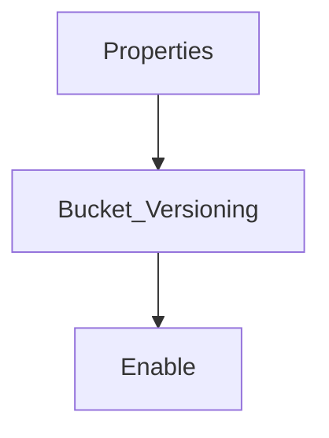

> [!Info] 
> Instead of overriding/replacing a file when a file of the same name is uploaded, will rename the previous version with a running increment v1..v2..v3

# Benefits
- Protect against unintended deletes
- Allows rollback to previous version

# Setting up

# Notes
- When turning on versioning in preexisting bucket, Files already uploaded will have version ID of null
- When deleting a file, instead of deleting, a delete marker will be placed and the services using it will return a 404 error
